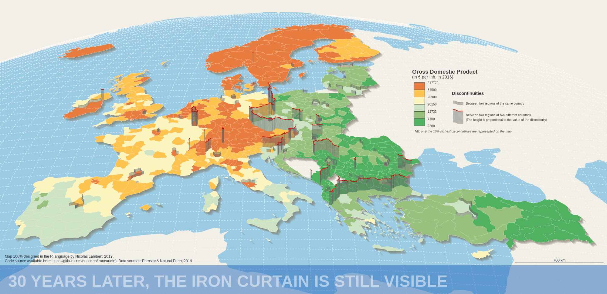

```{r setup, include=FALSE}

## Global options
knitr::opts_chunk$set(echo=TRUE,
        	            cache=FALSE,
                      prompt=FALSE,
                      comment=NA,
                      message=FALSE,
                      warning=FALSE,
                      class.source="bg-info",
                      class.output="bg-warning")
```

# Introduction {-}


Ce document montre comment réaliser cette carte de discontuités en 2,5D (fausse 3D) joliement mise en page entrièrement dans le langage R. Des versions antérieures de cette carte ont déjà été publiées par le passé, dans le manuel de cartographie [@lambert2016manuel], ou dans Mad Maps [@lambert2019mad] et ont fait l'objet de billets de blog [@lambert2019mise]. Ici, nous entendons prouver qu'il est possible de réaliser ce type de carte sans passer par un logiciel DAO [@lambert2019dessiner]. Les sources et les références sont précisées à la fin du document.

# Préparation des données

## Packages

Pour réaliser cette carte, nous nous nous appuyons sur 5 packages : le package  `sf` [@sf] pour gérer les objets spatiaux,  le package `mapsf` [@mapsf] pour l'affichage des différentes couches composant la carte, le package `eurostat` [@eurostat] pour les données et le package `rnaturalEarth` [@rnaturalearth] pour quelques couches d'habillages supplémentaires. Le package `scales` [@scales] sera uniquement utilisé pour réaliser une opération de rééchelonnage d'une série statistique.

```{r, eval = TRUE, message = FALSE, warning = FALSE}
library("sf")
library("mapsf")
library("eurostat")
library("rnaturalearth")
library("scales")
```

## Données géométriques

Avec le package `eurostat`, nous créons d'un fond de carte hybride avec maillage homogène NUTS2/3. Tous les pays sont au niveau NUTS3 version 2016 sauf l'Autriche, la Belgique, la Suisse, l'Allemagne, la Grèce, les Pays-Bas, la Turquie, l'Irlande, l'Islande et la Norvège. Pour des raisons de disponibilité des données post Brexit, Le Royaume-Uni est au niveau NUTS2 version 2013. 

Récupération des découpages NUTS de 2016 et construction d'un fond de carte NUTS 2/3 :

```{r, eval = TRUE, message = FALSE, warning = FALSE}
# NUTS 2016
nuts2016 <- get_eurostat_geospatial(
            output_class = "sf",
            resolution = "20",
            nuts_level = "all",
            year = "2016")

# Couche géographique des NUTS3 et NUTS2 pour 2016
nuts2016_3 <- nuts2016[nuts2016$LEVL_CODE == 3, ]
nuts2016_2 <- nuts2016[nuts2016$LEVL_CODE == 2, ]

# Liste des pays (code ISO) pour lesquels on s'intéresse aux NUTS2 
N2 <- c("AT", "BE", "CH", "DE", "EL", "NL", "UK", "TR", "IE", "IS", "NO")

# Couche géographique NUTS2/3 en fonction de la liste de pays N2
nuts <- rbind(nuts2016_2[nuts2016_2$CNTR_CODE %in% N2, ],
              nuts2016_3[!nuts2016_3$CNTR_CODE %in% N2, ])

# Suppression des départements d'Outre-mer français
nuts <- nuts[!nuts$id %in% c("FRY10", "FRY20", "FRY30", "FRY40", "FRY50"), ]

# Suppression du découpage NUTS 2016 pour le Royaume-Uni 
nuts <- nuts[nuts$CNTR_CODE != "UK", ]

# Sélection et renommage de colonnes
nuts <- nuts[,c("id","NUTS_NAME","geometry")]
colnames(nuts) <- c("id","name","geometry")
```
Fusion avec le découpage NUTS 2 2013 du Royaume-Uni :

```{r, eval = TRUE, message = FALSE, warning = FALSE}

# Récupération du découpage NUTS2 2013
nuts2013 <- get_eurostat_geospatial(
            output_class = "sf",
            resolution = "20",
            nuts_level = "2",
            year = "2013")

# Sélection des NUTS2 du Royaume-Uni et renommage de colonnes
uk <- nuts2013[nuts2013$CNTR_CODE == "UK",]

# Sélection et renommage de colonnes
uk <- uk[,c("id","NUTS_NAME","geometry")]
colnames(uk) <- c("id","name","geometry")

# Fusion des NUTS2 2013 du Royaume-Uni avec le fond de carte NUTS2/3 2016
nuts <- rbind(nuts, uk)

```
La couche géographique (objet `sf`) créée est donc une fusion des découpages territoriaux suivants : 

```{r, eval = TRUE, echo = FALSE, message = FALSE, warning = FALSE, fig.height = 3}
par(mar = c(0, 0, 0, 0), mfrow = c(1, 3))
mf_map(nuts, col = "#CCCCCC", border = NA)
mf_map(nuts[substr(nuts$id,1,2) %in%  c("AT", "BE", "CH", "DE", "EL", "NL", "TR", "IE", "IS", "NO"),],
       col = "#6eb1db",
       border = "white",
       lwd = 0.2, add = TRUE)
mf_title("NUTS 2 (version 2016)", bg = "#6eb1db")
mf_map(nuts, col = "#CCCCCC", border = NA)
mf_map(nuts[!substr(nuts$id,1,2) %in%  c("AT", "BE", "CH", "DE", "EL", "NL", "UK", "TR", "IE", "IS", "NO", "UK"),],
       col = "#6eb1db",
       border = "white",
       lwd = 0.2, add = TRUE)
mf_title("NUTS 3 (version 2016)", bg = "#6eb1db")
mf_map(nuts, col = "#CCCCCC", border = NA)
mf_map(nuts[substr(nuts$id,1,2) == "UK",],
       col = "#6eb1db",
       border = "white",
       lwd = 0.2, add = TRUE)
mf_title("NUTS 2 (version 2013)", bg = "#6eb1db")
```

## Données statistiques

Grâce au package `eurostat`, nous récupérons les données de PIB par habitant en 2016.

```{r, eval = TRUE, message = FALSE, warning = FALSE}
# Récupération des données (PIB/hab)
var <- "nama_10r_3gdp"
gdpinh <- get_eurostat(var, time_format = "num")

# Sélection de l'unité de mesure et de la date
gdpinh <- gdpinh[gdpinh$unit == "EUR_HAB",]
gdpinh <- gdpinh[gdpinh$time == 2016, c("geo","values")]
colnames(gdpinh) <- c("id","GDPINH_2016")
```

Les données pour le Royaume-Uni ne sont plus disponibles depuis le *Brexit*. Les données sont également manquantes pour quelques unités territoriales. Nous combinons donc les données issues d'`eurostat` avec des estimations issues de la [base de données ESPON](https://database.espon.eu/). Celles-si ont été préalablement stockées dans dans le fichier *missing.csv* mis à disposition (cf. ci-dessous). 

<br>  
<p class="center">[<span style="font-size: 230%;" class="glyphicon glyphicon-download-alt"></span> <br/> Télécharger les données](https://rzine.fr/docs/20191125_ironcurtain/data.zip)</p>
<br>

Nous combinons les deux jeux de données pour avoir une couverture exhaustive de l'espace à représenter :

```{r, eval = TRUE, message = FALSE, warning = FALSE}
missing <- read.csv("data/missing.csv")
gdpinh <- rbind(gdpinh, missing)
```

Pour des questions de reproductibilité, nous sauvegardons les données ainsi complétées dans le répertoire local data.

```{r, eval = TRUE, message = FALSE, warning = FALSE}
write.csv(gdpinh, "data/gdpinh.csv")
```

Nous effectuons ensuite une jointure entre les données et les géométries.

```{r, eval = TRUE, message = FALSE, warning = FALSE}
nuts <- merge(
        x = nuts,
        y = gdpinh,
        by = "id",
        all.x = TRUE)
```

## Couches d'habillage

Pour compléter la carte, nous utilisons des couches géographiques proposées par le package `rnaturalearth`.

```{r, eval = TRUE, message = FALSE, warning = FALSE, results = "hide"}
land <- ne_download(
        scale = 110,
        type = "land",
        category = "physical",
        returnclass = "sf")
```
Affichage de la couche d'habillage avec la fonction `mf_map` du package `mapsf`.

```{r, eval = TRUE, message = FALSE, warning = FALSE}
mf_map(land, border = NA, col = "#6eb1db")
```

```{r, eval = TRUE, message = FALSE, warning = FALSE, results = "hide"}
ocean <- ne_download(
         scale = 110,
         type = "ocean",
         category = "physical",
         returnclass = "sf")
```

```{r, eval = TRUE, message = FALSE, warning = FALSE}
mf_map(ocean, border = NA, col = "#6eb1db")
```

Puis, nous créons une couche de graticules avec la fonction `st_graticule` du package `sf`.

```{r, eval = TRUE, message = FALSE, warning = FALSE, results = "hide"}
graticule = st_graticule(
            crs = st_crs(4326),
            ndiscr = 100,
            lon = seq(-180, 180, by = 2),
            lat = seq(-90, 90, by = 1),
            margin = 0.01)
```

```{r, eval = TRUE, message = FALSE, warning = FALSE}
mf_map(graticule, col = "#6eb1db")
```

## Projection orthographique

Pour donner un effet de rotondité et permettre une représentation en 2.5D, on opte pour une projection orthographique centré sur l'Afrique. Pour éviter tout problème dans l'opération de projection (bug, artefacts, etc.), nous définissons au préalable un rectangle nous servant à découper les différentes couches. 

```{r, eval = TRUE, message = FALSE, warning = FALSE, results = "hide"}
# Construction du rectangle
bb <- st_as_sfc(x = st_bbox(c(xmin = -50 , xmax = 70, ymin = 20, ymax = 80),
                crs = st_crs(4326)))

```


Puis, nous découpons toutes les couches d'habillage en fonction du rectangle préalablement crée.
Pour que cette opération se passe bien, nous utilisons la fonction `sf_use_s2` du package `sf` en paramétrant l'argument `use_s2` en `FALSE` pour faire comme si les latitudes et longitudes étaient des coordonnées euclidiennes. Une fois les intersections effectuées, nous réutilisons cette fonction en paramétrant l'argument `use_s2` en `TRUE`.

```{r, eval = TRUE, message = FALSE, warning = FALSE, results = "hide"}
sf_use_s2(FALSE)

ocean <- st_intersection(ocean, bb)
ocean <-  st_segmentize(ocean, 100)
land <- st_intersection(land, bb)
land <-  st_segmentize(land, 100)
graticule <- st_intersection(graticule, bb)

sf_use_s2(TRUE)
```

Nous projetons ensuite toutes les couches géographiques crées dans une projection orthographique centrée sur l'Afrique (10° de latitude nord et 15° de longitude). 

```{r, eval = TRUE, message = FALSE, warning = FALSE, results = "hide"}
# Définition de la projection en format "proj-strings" (PROJ.4) 
ortho <- "+proj=ortho +lat_0=-10 +lon_0=15 +x_0=0 +y_0=0
          +ellps=WGS84 +units=m +no_defs"

# Reprojection des couches géographiques
ocean <- st_transform(ocean, ortho)
land <- st_transform(land, ortho)
graticule <-  st_transform(graticule, ortho)
nuts <- st_transform(nuts, ortho)
```

Affichage de l'ensemble des couches recadrées et projetées, en utilisant des fonctions du package `mapsf`.

```{r, eval = TRUE, message = FALSE, warning = FALSE}
par(mar = c(0, 0, 0, 0), mfrow = c(2, 2))

mf_map(land, col = "#6eb1db", border = NA)
mf_title("land", bg = "#6eb1db")

mf_map(ocean, col = "#6eb1db", border = NA)
mf_title("ocean", bg = "#6eb1db")

mf_map(graticule, col = "#6eb1db", lwd = 1)
mf_title("graticule", bg = "#6eb1db")

mf_map(nuts, col = "#6eb1db", border = "white", lwd = 0.2)
mf_title("nuts", bg = "#6eb1db")

```

## Effet d'ombrage 

On peut générer un effet d'ombrage en agrégeant les régions NUTS et en effectuant des déplacements successifs avec de la transparence. Ci-dessous, un exemple sur la France métropolitaine :

```{r, eval = TRUE, message = FALSE, warning = FALSE}
# Union de l'ensemble des entités de la couche géographique nuts
fr <- st_union(nuts[substr(nuts$id, 1, 2) == "FR", ])

# Paramétrage des marges de la fenêtre graphique
par(mar = c(0, 0, 0, 0))

# Affichage multiple de la couche, en appliquant à chaque fois un léger décalage
mf_map(fr + c(5000,-5000), col = "#827e6c40", border = NA)
mf_map(fr + c(10000,-10000), col = "#827e6c40", border = NA, add = TRUE)
mf_map(fr + c(15000,-15000), col = "#827e6c40", border = NA, add = TRUE)
mf_map(fr + c(20000,-20000), col = "#827e6c40", border = NA, add = TRUE)
mf_map(fr + c(25000,-25000), col = "#827e6c40", border = NA, add = TRUE)
mf_map(fr, col = "#6eb1db", border = "white", lwd = 0.1, add = TRUE)
```

<br>
<div class="alert alert-success" role="alert">
**L'ajout d'un nombre entre 01 et 99 à la fin d'un code hexadécimal permet d'appliquer un pourcentage d'opacité à la couleur désignée**. Par exemple, le code hexadécimal "#ffffff<b>40</b>" affiche du blanc avec une opacité de 40 %.</div>


## Modèle de mise en page

A partir des différentes couches géographiques construites, recadrées et reprojetées, nous réalisons à présent un modèle de mise en page cartographique. 

Pour cela, nous définissons précisément l'emprise de la carte dans le système de coordonnées de la projection. Les coordonnées étant en mètres, nous utilisons un facteur 100 000 (variable k) qui nous permet de manipuler des chiffres plus petits avec un niveau de précision satisfaisant. Nous utiliserons également ce facteur k pour positionner les différents éléments d'habillage de la carte. 

```{r, eval = TRUE, message = FALSE, warning = FALSE}

# Création de la variable k
k <- 100000

# Coordonnées de l'emprise * k
extent <- c(-20, 42, 24.5, 63) * k

# Construction de l'emprise (objet sfc)
bb <- st_as_sfc(x= st_bbox(c(xmin = extent[1], xmax = extent[3], ymin = extent[2], ymax = extent[4]),
               crs = st_crs(nuts)))

```

On crée ensuite la fonction `template()` qui contient le modèle de mise en page souhaité. Ce modèle est construit à l'aide de fonctions mises à disposition par le package `mapsf`.

<div class="alert alert-danger" role="alert">
Une fonction d'export est incluse dans `template()`. <b>Le résultat de cette fonction est donc une sortie graphique au format png, directement enregistrée sur votre machine.</b>
<b>Ainsi, l'utilisation de cette fonction doit obligatoirement être couplée avec la fonction</b>  `dev.off()`qui permet de d'éteindre la fenêtre graphique et de lancer l'enregistrement de son contenu dans un fichier image.

L'intégration d'un export automatique de la carte dans la fonction `template()` <b>permet de contrôler précisément les marges et le dimensionnement de la figure générée</b>, quelque soit la taille de la fenêtre graphique.</div>

```{r, eval = TRUE, message = FALSE, warning = FALSE}

# Création de la fonction
template = function(file) {
  
  # Création d'un thème
  theme <- mf_theme(x = "default",
                    bg = "#f2efe6",
                    fg = "#f2efe6",
                    mar = c(0, 0, 0, 0),
                    tab = TRUE,
                    pos = "left",
                    inner = FALSE,
                    line = 2,
                    cex = 1.9,
                    font = 3)
  
  # Paramétrage de l'export de la carte en format png
  mf_export(bb,
            export = "png",
            width = 2000,
            filename = file,
            res = 150,
            theme = theme,
            expandBB = c(-.02, 0, 0.05, 0))

  # Affichage de la couche 'ocean'
  mf_map(ocean, col = "#9acbe3", border = "#9acbe3", lwd = 5, add = TRUE)
  
  # Affichage de la couche 'graticule'      
  mf_map(graticule, col = "#FFFFFF80", lwd = 1.5, lty = 3, add = TRUE)
  
  
  # Affichage d'un effet d'ombrage pour la couche 'nuts'         
  ue <- st_union(nuts)
  mf_map(ue + c(5000,-5000), col = "#827e6c40", border = NA, add = TRUE)
  mf_map(ue + c(10000,-10000), col = "#827e6c40", border = NA, add = TRUE)
  mf_map(ue + c(15000,-15000), col = "#827e6c40", border = NA, add = TRUE)
  mf_map(ue + c(20000,-20000), col = "#827e6c40", border = NA, add = TRUE)
  mf_map(ue + c(25000,-25000), col = "#827e6c40", border = NA, add = TRUE)

  # Affichage de la couche 'nuts'
  mf_map(nuts, col = "#dbccb6", border = "white", lwd = 0.3, add = TRUE)
  
  # Affichage d'un bandeau bleu transparent sous le titre
  rect(-22 * k, 
       41.3 * k, 
       28 * k, 
       41.3 * k + 250000, 
       border = NA, col = "#2369bd80")

  # Affichage du titre
  text(x = -21.5 * k,
       y = 42.4 * k,
       labels = "30 YEARS LATER, THE IRON CURTAIN IS STILL VISIBLE",
       cex = 2.14,
       pos = 4,
       font = 2,
       col = "#FFFFFF80")
  
  # Affichage des sources
  text(x = -21.75 * k,
       y = 44.25 * k,
       labels = "Map 100% designed in the R language by Nicolas Lambert, 2019. 
Code source available here: https://github.com/neocarto/ironcurtain). Data sources: Eurostat & Natural Earth, 2019",
       cex = 0.5,
       pos = 4,
       font = 1,
       col = "#3f4654")
  
  # Affichage d'une échelle
  mf_scale(size = 700,
           lwd = 0.6,
           cex = 0.5,
           col = "#3f4654",
           pos = c(19 * k, y = 44 * k))
}
```

Et voilà le résultat :-)

```{r, eval = TRUE, message = FALSE, warning = FALSE, results = "hide"}
# Indiquez le nom du fichier png crée
# Utilisez dev.off() pour clôturer l'export et l'enregistrement du fichier
template("figures/fig1.png")
dev.off()
```


**Le résultat ne s'affiche pas dans la fenêtre graphique. Il est directement enregistré en format png dans le répertoire souhaité.**

# Carte choroplèthe

Maintenant que le modèle de mise en page est reproductible avec la fonction `template()` précédemment créée, penchons-nous sur la représentation cartographique du PIB par habitant.

## Choix des classes et des couleurs

Nous utilisons la fonction `mf_get_breaks()` pour discrétiser notre distribution statistique.

```{r, eval = TRUE, message = FALSE, warning = FALSE}

# Discrétisation par quantile
bks <- mf_get_breaks(x = nuts$GDPINH_2016,
                     nbreaks = 6,
                     breaks = "quantile")

# Vecteur de couleurs (1 par classe)
cols <- c("#50b160",
          "#98c17e",
          "#cce3c4",
          "#fbf5bd",
          "#fcc34f",
          "#e97d40")
```

## Réalisation de la carte

Nous pouvons alors facilement cartographier le PIB par habitant en utilisant la fonction de mise en page `template()` puis la fonction `mf_map()` pour représenter la variable souhaitée.

```{r, eval = TRUE, message = FALSE, warning = FALSE, results = "hide"}

# Utilisation du modèle de mise en page (+ export de la carte)
template("figures/fig2.png")

# Cartographie du PIB par habitant
mf_map(x = nuts,
       var = "GDPINH_2016",
       type = "choro",
       breaks = bks,
       pal = cols,
       lwd = 0.2,
       leg_pos = "n",
       add = TRUE)

# Ajout d'une légende
mf_legend(type = "choro",
          pos = c(11 * k, 59.05 * k),
          title = "",
          val = bks,
          val_cex = 0.4,
          pal = cols,
          fg = "#333333",
          cex = 0.85,
          border = "red",
          val_rnd = 0,
          no_data = FALSE,
          frame = FALSE)

# Ajout d'un titre de légende
text(10.5 * k,
     y = 59.1 * k,
     labels = "Gross Domestic Product",
     cex = 0.75,
     pos = 4,
     font = 2,
     col = "#404040")

# Ajout d'un sous-titre de légende
text(10.5 * k,
     y = 58.7 * k,
     labels = "(in € per inh. in 2016)",
     cex = 0.55,
     pos = 4,
     font = 1,
     col = "#404040")

# NE PAS OUBLIER !
dev.off()
```


# Discontinuités

La première étape pour cartographier les discontinuités spatiales est de récupérer les frontières entre les régions NUTS.
Pour cela, nous calculons une petite zone tampon (pour éliminer les éventuelles erreurs topologiques) et effectuons une auto-intersection des polygones de la couche 'nuts'. Nous définissons les géométries de sortie en MULTILINESTRING. 

```{r, eval = TRUE, message = FALSE, warning = FALSE}

# Auto-intersection de la couche NUTS (avec buffer de 5m)
nuts.borders  <- st_intersection(st_buffer(nuts, 5), st_buffer(nuts, 5)) 

# Transformation des géométries en 'MULTILINESTRING'
nuts.borders  <- st_cast(nuts.borders ,"MULTILINESTRING")

# Suppression des intersections entre les mêmes polygones
nuts.borders  <- nuts.borders [nuts.borders $id != nuts.borders $id.1, ] 

# Construction d'un identifiant unique pour chaque frontière
nuts.borders$id1 <- nuts.borders$id
nuts.borders$id2 <- nuts.borders$id.1
nuts.borders$id <-  paste0(nuts.borders$id1, "_", nuts.borders$id2)
rownames(nuts.borders) <- nuts.borders$id
nuts.borders  <- nuts.borders [,c("id","id1","id2","geometry")]
```

Puis, nous effectuons une double jointure pour relier à chaque frontière NUTS les données de PIB par habitant des régions limitrophes.

```{r, eval = TRUE, message = FALSE, warning = FALSE}

# Récupération des données de PIB par habitant, en supprimant la géométrie associée
vals <- st_set_geometry(x = nuts[, c("id","GDPINH_2016")], 
                        value = NULL)

# Double jointure pour récupérer les valeurs des deux entités limitrophes
nuts.borders <- merge (x = nuts.borders, y = vals, by.x = "id1", by.y = "id", all.x = T)
nuts.borders <- merge (x = nuts.borders, y = vals, by.x = "id2", by.y = "id", all.x = T)
```

Nous calculons pour chaque frontière une valeur de discontinuité. Ici, discontinuités relatives :

```{r, eval = TRUE, message = FALSE, warning = FALSE}
nuts.borders$disc <- nuts.borders$GDPINH_2016.x / nuts.borders$GDPINH_2016.y
```

Nous choisissons de conserver uniquement les plus fortes discontinuités (10 %). Cela revient à choisir comme seuil la valeur 0.95 car la table présente deux valeurs pour chaque frontière (les rapports A/B et B/A).

```{r, eval = TRUE, message = FALSE, warning = FALSE}
threshold <- 0.95
disc <- nuts.borders[nuts.borders$disc >= quantile(nuts.borders$disc,threshold),]
```

Affichage des discontinuités sélectionnées dans le modèle de mise en page :

```{r, eval = TRUE, message = FALSE, warning = FALSE, results = "hide"}
template("figures/fig3.png")

mf_map(x = disc,
       col = "#d92e94",
       lwd = 3,
       add = TRUE)

dev.off()
```


On constate que les fortes discontinuités entre les régions européennes suivent très largement le tracé de l'ancien rideau de fer (si on fait abstraction de ancienne frontière RFA/RDA). **C'est cela que nous souhaitons mettre en valeur par un procédé d'extrusion pour rappeler la symbolique du mur**.

# Extrusion

Pour extruder les lignes, nous procédons de la même façon que pour l'effet d'ombrage ([cf. partie 1.6](#effet-dombrage)). Nous translatons les lignes plusieurs fois en ordonnée (y, vers le haut). Sur la projection orthographique utilisée, cela produit un effet 3D. Le nombre d'itérations et l'écart entre les lignes détermine la hauteur du mur. Exemple pour une frontière :

```{r, eval = TRUE, message = FALSE, warning = FALSE}
# On sélectionne une ligne (frontière) au hasard
line <- st_geometry(disc[5, ])

# nombre d'itérations
nb <- 15

# valeur de translation
delta <- 200

```

On effectue alors une boucle *for* qui construit 15 ('nb') lignes, décalées de 'delta' à chaque fois.

```{r, eval = TRUE, message = FALSE, warning = FALSE}

# Paramétrage des marges et de la couleur de fond
par(mar = c(0, 0, 0, 0), bg = "#f2efe6")

# Affichage de la frontière
mf_map(line, col = "#66666690", lwd = 0.5)

# 'nb' affichage de la frontière, décalée de 'delta' à chaque fois
for (j in 1:nb) {
  line <- line + c(0, delta)
  mf_map(line,
         col = "#66666690",
         lwd = 0.5 ,
         add = TRUE)
}

# Affichage de la dernière ligne calculée en rouge, avec une épaisseur de 1.2
mf_map(line,
       col = "#cf0e00",
       lwd = 1.2,
       add = TRUE)
```

**Pour que l'effet 3D fonctionne bien, l'ordre d'affichage des discontinuités est important.** Nous décomposons donc les lignes et les ordonnons en fonction de la valeur en ordonnée (y) de leur centroïde. Cela permet d'afficher les discontinuités du Nord au Sud. Ainsi, les lignes qui sont "devant" apparaissent devant.

```{r, eval = TRUE, message = FALSE, warning = FALSE}
# Transformation du type de géométrie
disc <- st_cast(disc,"LINESTRING")

# Calcul des coordonnées des centroïdes de chaque lignes
c <- as.data.frame(st_coordinates(st_centroid(disc)))

# Récupération de la valeur y de chaque centroïde
disc$Y <- c$Y

# Tri des discontinuités en fonction de la valeur de y 
disc <- disc[order(disc$Y, decreasing = TRUE), ]
```

Nous considérons que les frontières nationales renvoient à des disparités historiques plus dures. Ainsi, nous choisissons de traiter différemment les discontinuités entre deux régions d'un même pays et les discontinuités entre deux régions de deux pays différents. Les premières auront une "hauteur de mur" constante (8 itérations). Les secondes auront une "hauteur de mur" qui dépendra de la valeur des discontinuités (entre 30 et 70 itérations) et seront représentées en rouges.

Dans un premier temps, nous calculons une "hauteur de mur" proportionnelle à la valeur de discontinuité relative de chaque ligne. Nous rééchelonnons l'étendue de la distribution entre les valeurs 30 et 70. La plus faible (des plus fortes) discontinuité sera itérée 30 fois, la plus forte 70 fois. 

Pour réaliser ce rééchelonnage, nous utilisons la fonction `rescale` du package `scale`.

```{r, eval = TRUE, message = FALSE, warning = FALSE}
# Rééchelonnage des valeurs de discontinuité, de 30 à 70
disc$height <- round(rescale(disc$disc, to=c(30,70)),0)
```

On affecte également par défaut la couleur rouge et la même épaisseur à toutes les lignes, en les stockant dans deux nouvelles variables ('col' et 'thickness').

```{r, eval = TRUE, message = FALSE, warning = FALSE}
disc$col <-"#cf0e00"
disc$thickness <- 1.2
```

Nous devons ensuite repérer les discontinuités infra-nationales afin de modifier les valeurs à représenter. Pour cela nous utilisons les deux premières lettres des codes NUTS associées à chaque ligne, puisqu'elles correspondent au code ISO du pays d'appartenance.

```{r, eval = TRUE, message = FALSE, warning = FALSE}
disc$c1 <- substr(disc$id1,1,2)
disc$c2 <- substr(disc$id2,1,2)
```

A l'aide d'une boucle *for* et d'un test *if*, nous pouvons détecter les frontières infra-nationales. 
Nous modifions alors les valeurs des variables 'height', 'col' et 'thickness' (qui seront utilisées pour la représentation des discontinuités) pour toutes ces lignes.

```{r, eval = TRUE, message = FALSE, warning = FALSE}

# Boucle qui parcours toutes les lignes
for (i in 1:length(disc$disc)){ 
  
  # Pays 1 == Pays 2 ?
  if (disc$c1[i]== disc$c2[i]) {
      disc$height[i] <- 8  
      disc$col[i] <-"#66666690"
      disc$thickness[i] <- 0.5
      
  }
}
```

Toutes les valeurs à représenter ont été calculées. Nous pouvons alors construire une fonction d'extrusion (représentation graphique) des lignes en fonction des valeurs calculées.

```{r, eval = TRUE, message = FALSE, warning = FALSE}

# valeur de translation
delta <- 2500  

# Création de la fonction extrude()
extrude <- function(id){

  line <- st_geometry(disc[id,])
  mf_map(line, col= "#66666690",lwd = 0.5 ,add= TRUE)
  nb <- as.numeric(disc[id,"height"])[1]
  
  for (j in 1:nb){
    line <- st_geometry(line) + c(0,delta)
    mf_map(st_geometry(line), col= "#66666690",lwd = 0.5 ,add= TRUE)
  }
  
  mf_map(line, col= disc$col[id],lwd = disc$thickness[id] ,add= TRUE)
  
}
```

On applique la fonction à toutes les lignes de la façon suivante

```{r, eval = TRUE, message = FALSE, warning = FALSE, results = "hide"}
template("figures/fig4.png")


### APPLY ???

for (i in 1:length(disc$height))
{
  extrude(i)
}

# Habillage
d = 0.75 * k
text(14.4*k - d, y = 57.4*k, "Discontinuities", cex = 0.6,
     pos = 4, font = 2, col="#404040")     
text(15.5*k - d, y = 56.6*k, "Between two regions of the same country",
     cex = 0.4, pos = 4, font = 1, col="#404040")   
text(15.5*k - d, y = 55.7*k, "Between two regions of two different countries",
     cex = 0.4, pos = 4, font = 1, col="#404040")   
text(15.5*k - d, y = 55.3*k,
     "(The height is proportional to the value of the dicontinuity)",
     cex = 0.4, pos = 4, font = 1, col="#404040")   
text(10.7*k, y = 54.4*k,
     "NB: only the 10% highest discontinuities are represented on the map.",
     cex = 0.4, pos = 4, font = 3, col="#404040")   

# Lignes

myline <- disc[disc$id == "TR21_BG341",]
st_geometry(myline) <- st_geometry(myline) + c(4.2*k, 5*k)
myline2 <- myline
st_geometry(myline2) <- st_geometry(myline2) + c(0, 1.5*k)

# discontinuités entre deux régions de deux pays différentes
  
  plot(myline, col= "#66666690",lwd = 0.5 ,add= T)
  for (i in 1:40){
    myline <- st_geometry(myline) + c(0,delta)
    plot(st_geometry(myline), col= "#66666690",lwd = 0.5 ,add= T)  
  }
  plot(myline, col= "#cf0e00",lwd = 1.2 ,add= T)

# discontinuités entre deux régions d'un même pays

  plot(myline2, col= "#66666690",lwd = 0.5 ,add= T)
  for (i in 1:8){
    myline2 <- st_geometry(myline2) + c(0,delta)
    plot(st_geometry(myline2), col= "#66666690",lwd = 0.5 ,add= T)  
  }
  plot(myline2, col= "#66666690",lwd = 0.5 ,add= T)
dev.off()
```


# Carte finale

```{r, eval = TRUE, message = FALSE, warning = FALSE, results = "hide"}
template("figures/ironcurtain.png")

mf_map(
  x = nuts,
  var = "GDPINH_2016",
  type = "choro",
  breaks = bks,
  pal = cols,
  lwd = 0.2,
  leg_pos = "n",
  add = TRUE
)

mf_legend(
  type = "choro",
  pos = c(11 * k, 59.05 * k),
  title = "",
  val = bks,
  val_cex = 0.4,
  pal = cols,
  fg = "#333333",
  cex = 0.85,
  border = "red",
  val_rnd = 0,
  no_data = FALSE,
  frame = FALSE
)

text(
  10.5 * k,
  y = 59.1 * k,
  "Gross Domestic Product",
  cex = 0.75,
  pos = 4,
  font = 2,
  col = "#404040"
)
text(
  10.5 * k,
  y = 58.7 * k,
  "(in € per inh. in 2016)",
  cex = 0.55,
  pos = 4,
  font = 1,
  col = "#404040"
)

for (i in 1:length(disc$height))
{
  extrude(i)
}

# Habillage
d = 0.75 * k
text(14.4*k - d, y = 57.4*k, labels = "Discontinuities", cex = 0.6,
     pos = 4, font = 2, col="#404040")     
text(15.5*k - d, y = 56.6*k, labels = "Between two regions of the same country",
     cex = 0.4, pos = 4, font = 1, col="#404040")   
text(15.5*k - d, y = 55.7*k, labels = "Between two regions of two different countries",
     cex = 0.4, pos = 4, font = 1, col="#404040")   
text(15.5*k - d, y = 55.3*k,
    labels = "(The height is proportional to the value of the dicontinuity)",
     cex = 0.4, pos = 4, font = 1, col="#404040")   
text(10.7*k, y = 54.4*k,
     labels = "NB: only the 10% highest discontinuities are represented on the map.",
     cex = 0.4, pos = 4, font = 3, col="#404040")   

# Lignes

myline <- disc[disc$id == "TR21_BG341",]
st_geometry(myline) <- st_geometry(myline) + c(4.2*k, 5*k)
myline2 <- myline
st_geometry(myline2) <- st_geometry(myline2) + c(0, 1.5*k)

# discontinuités entre deux régions de deux pays différentes
  
  plot(myline, col= "#66666690",lwd = 0.5 ,add= T)
  for (i in 1:40){
    myline <- st_geometry(myline) + c(0,delta)
    plot(st_geometry(myline), col= "#66666690",lwd = 0.5 ,add= T)  
  }
  plot(myline, col= "#cf0e00",lwd = 1.2 ,add= T)

# discontinuités entre deux régions d'un même pays

  plot(myline2, col= "#66666690",lwd = 0.5 ,add= T)
  for (i in 1:8){
    myline2 <- st_geometry(myline2) + c(0,delta)
    plot(st_geometry(myline2), col= "#66666690",lwd = 0.5 ,add= T)  
  }
  plot(myline2, col= "#66666690",lwd = 0.5 ,add= T)
dev.off()
```


Et voilà. Même si cela nécessite quelques tâtonnements pour positionner les différents éléments, nous venons de faire la démonstration qu'il est donc possible de faire de la cartographie d'édition, stylisée et mise en page, uniquement avec R :-)
<br>


# Bibliographie {-}

<div id="refs"></div>

<br/>


# Annexes {-}


## Info session  {-}

```{r session_info, echo=FALSE}
kableExtra::kable_styling(knitr::kable(rzine::sessionRzine()[[1]], row.names = F))
kableExtra::kable_styling(knitr::kable(rzine::sessionRzine()[[2]], row.names = F))
```


## Citation {-}

```{r Citation, echo=FALSE}

rref <- bibentry(
   bibtype = "misc",
   title = "Le nouveau rideau de fer",
   subtitle = "Un exemple de carte en 2.5D",
   author = c("Nicolas Lambert"),
   doi = "10.48645/xxxxx",
   url = "https://rzine.fr/publication_rzine/xxxxxxxxx/",
   keywords ="FOS: Other social sciences",
   language = "fr",
   publisher = "FR2007 CIST",
   year = 2021,
   copyright = "Creative Commons Attribution Share Alike 4.0 International")

``` 

`r capture.output(print(rref))`

### BibTex : {-}

```{r generateBibTex, echo=FALSE}

writeLines(toBibtex(rref), "cite.bib")
toBibtex(rref)

``` 

<br/>

